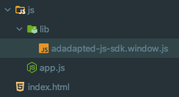

# AdAdapted JS SDK

The AdAdapted Javascript SDK.

[[_TOC_]]

## Features

-   Ad zone creation
-   In-app ad display popup
-   In-list add suggestion based on available keywords
-   Event tracking enabling reporting
-   Supported ad types:
    -   Add to list (reports a product to add to a list)
    -   Popup external link (opens in-app within popup view)

## Installation

```
npm install --save @adadapted/js-sdk
```

## Usage

### Embedded <script\/> Approach

The following approach uses an embedded script tag to import/include the `adadapted-js-sdk.window.js` file. The following examples are in the context of a [Cordova](https://cordova.apache.org/) app, but can be easily adapted to any project that needs to use this approach.

**STEP 1:**

This approach involves copying the built javascript file from the `node_modules` folder and placing it directly in your project.

Copy the following file:

`node_modules/@adadapted/js-sdk/dist/adadapted-js-sdk.window.js`

and place it into a designated folder within your project like so:



**NOTE:** _The file in the image above can be placed at any location._

---

**STEP 2:**

Next, place the following `<script/>` tag in your `index.html`(_or whatever your entry HTML file name is_):

```html
<script type="text/javascript" src="js/lib/adadapted-js-sdk.window.js"></script>
```

**NOTE:** _Make sure to update the `src` attribute value with the correct path you placed the file in from step 1._

---

**STEP 3:**

Now that the AdAdapted SDK is available for reference, you need to create a reference to the SDK for your use. You can do this by defining a variable in your `app.js` file within your app definition as follows:

```javascript
const app = {
    /**
     * The AdadaptedJsSdk instance.
     */
    aaSdk: {},

    // ...

    onDeviceReady: function () {
        // Assign a reference to the SDK.
        this.aaSdk = new window.AdadaptedJsSdk.Sdk();

        // ...
    },

    // ...
};

app.initialize();
```

The above code defines an `aaSdk` property on your `app` object. Then, once the device is ready, assigns it the reference to the AdAdapted SDK.

---

**STEP 4:**

After the `aaSdk` property has been assigned, you can then call the `.initialize()` method on it. This will initialize a valid SDK session with the configuration you provide.

```javascript
this.aaSdk.initialize({
    appId: "YOUR_APP_ID_HERE",
    deviceUUID: "THE_DEVICE_UUID_HERE",
    zonePlacements: {
        "12345": "testZoneId1",
        "12346": "testZoneId2"
    },
    onAdZonesRefreshed: () => {
        // ...
    },
    onAddToListTriggered: (items) => {
        // ...
    },
})
.then(() => {
    // ...
})
.catch((err) => {
    console.error(err);
});
```

The `.initialize()` method is a promise and will resolve in the `.then()` callback once finished. If you provide an invalid configuration to the `.initialize()` method, the promise will resolve to the `.catch()` callback and report the initialization error.

For more information on the configuration properties you must provide the `.initialize()` method, see the [Available Methods: initialize()](#initialize) section below.

---

**STEP: 5**

**NOTE:** _This step only applies if you are using the Keyword Intercept feature._

When a user searches for an item and you present to them a list of options to choose to add to their shopping list, you can additionally get a suggested ad item from the AdAdapted SDK based on their search term/value. To do this, you can call the `.performKeywordSearch()` method on your SDK reference and pass it the search term/value as follows:

```javascript
const aasdkSearchResults = sdkRef.performKeywordSearch(searchValue);
```

The resulting array is a list of ad items that can be displayed. This list is already pre-sorted in the order of usage priority. Based on the number of ad items you would like to display in your resulting list, you can grab that many items from the list starting from index zero.

When using Keyword Intercepts, you must report when an item is _presented_ to and _selected_ by a user. Your SDK reference has two methods you will need to call when these scenarios occur.

Call the following when the user is _presented_ a Keyword Intercept ad item that was provided by the AdAdapted SDK:

```javascript
sdkRef.reportKeywordInterceptTermsPresented([
    aasdkSearchResults[0].term_id,
    aasdkSearchResults[1].term_id,
]);
```

This will make an API call to AdAdapted to report the ad item(s) that you decided to displayed to the user. The method accepts an array of `term_id` and must be provided to the method as an array even if you only displayed a single ad item to the user. Making sure to call this method when an ad item is presented to the user will enable accurate reporting in the reports AdAdapted provides you.

Call the following when the user has _selected_ a Keyword Intercept ad item from the search result list you present to them:

```javascript
sdkRef.reportKeywordInterceptTermSelected(selectedItem.item.term_id);
```

**NOTE:** _The above code assumes you have the ad item object(`selectedItem`) available to you to extract and send the `term_id` at the time the user selected the item from your list._

## Available Methods

### initialize()

The initialize method is where your SDK session is created. This method returns a promise that when complete, your reference to the SDK will have a valid SDK session going forward. Once you have a valid session, you will be able to successfully use other SDK methods. You should call this method as soon as possible and only once (upon page load / in your app constructor).

```javascript
aaSdk.initialize({
    /**
     * The app ID provided to you by AdAdapted.
     * If you have multiple variations of the app, you will be provided with multiple App IDs.
     * For each App ID you have, you will need to determine the correct one to provide the SDK when initializing based on the users variation of the app.
     * Must be provided for the SDK to initialize.
     */
    appId: string,
    /**
     * The device UUID.
     * You will need to extract the native device UUID and provide it.
     * Must be provided for the SDK to initialize.
     */
    deviceUUID: string,
    /**
     * The zone placement mapping object.
     * Ad zones will not be rendered on screen unless this mapping is provided.
     * key: The zone ID provided to you by AdAdapted.
     * value: The element ID of the container element you want the zone rendered in.
     */
    zonePlacements: {[key: string]: string},
    /**
     * (Optional)
     * Provide this value to define what API environment the SDK should use.
     *
     * Possible Values:
     *     - Production: AdadaptedJsSdk.ApiEnv.Prod
     *     - Development: AdadaptedJsSdk.ApiEnv.Dev
     * 
     * Production is the default value if you don't provide this property in your config. 
     */
    apiEnv: AdadaptedJsSdk.ApiEnv,
    /**
     * (Optional)
     * Triggered when the available ad zones have
     * refreshed their data with the AdAdapted API.
     */
    onAdZonesRefreshed(() => {}),
    /**
     * (Optional)
     * Triggered when an "add to list" action has taken
     * place by a user by interacting with an ad zone.
     */
    onAddToListTriggered((items[]) => {})
})
```

**Return Type:**

```
Promise<void>
```

---

### getSessionId()

Once the SDK is initialized, this method returns the current session ID.

```javascript
aaSdk.getSessionId();
```

**Return Type:**

```
string
```

---

### performKeywordSearch()

Once the SDK is initialized, this method can be called when performing a search operation within your app. Call this method either as the user types in a search term or when the user executes a search after the term is entered. A list of keyword search results will be returned by this method that can then be used to display dynamically along with the search results your app displays to the user. The final result of the search may have many items, in which case you would determine how many of them you would like to display.

```javascript
aaSdk.performKeywordSearch(searchTerm: string);
```

**Return Type:**

```javascript
[
    /**
     * The search term ID.
     */
    term_id: string;
    /**
     * The search term that was used to validate
     * the provided search string against.
     */
    term: string;
    /**
     * The display string you can use to display the
     * resulting item in your search results list.
     */
    replacement: string;
    /**
     * The display priority of this item amongst all
     * other keyword search results. The priority acts
     * as a secondary sort. The primary sort is based
     * on whether the "term" starts with the provided
     * search term characters or not.
     *
     * NOTE: Sorting is already handled for you by the SDK.
     * The results will already be in the correct sort order.
     */
    priority: number;
]
```

The final result is sorted based on the following criteria:

-   First, the items are sorted based on which ones "started" with the characters in the provided search string
-   Second, they are then sorted by the "priority" property for each keyword that satisfied the search

**Search Example:** _che_

| Keyword Term        | Priority |
| ------------------- | -------- |
| **Che**x Mix        | 2        |
| **Che**ddar Cheese  | 3        |
| Sweet **Che**rries  | 1        |
| Mac & **Che**ese    | 4        |
| Water **Che**stnuts | 5        |

---

### reportKeywordInterceptTermsPresented()

This method must be called anytime a keyword suggestion(provided by the `performKeywordSearch()` method) is displayed to the user. Calling this method reports back these suggested keywords to AdAdapted.

**NOTE:** _Making sure to call this method when a keyword is displayed will ensure AdAdapted can provide you with the most accurate reporting results._

This method accepts a list of `term_id` of the displayed keywords. See `performKeywordSearch()` return type for more info on the `term_id` property.

```javascript
aaSdk.reportKeywordInterceptTermsPresented(termIds: string[]);
```

**Return Type:**

```
void
```

---

### reportKeywordInterceptTermSelected()

This method must be called anytime a keyword suggestion(provided by the `performKeywordSearch()` method) is selected by the user from your displayed search result list. Calling this method reports back the selected keyword to AdAdapted.

**NOTE:** _Making sure to call this method when a keyword is selected will ensure AdAdapted can provide you with the most accurate reporting results._

This method accepts the `term_id` from the selected keyword. See `performKeywordSearch()` return type for more info on the `term_id` property.

```javascript
aaSdk.reportKeywordInterceptTermSelected(termId: string);
```

**Return Type:**

```
void
```

## Available Callbacks

### onAdZonesRefreshed()

This callback method is useful for knowing when the Ad Zone data gets refreshed by the API. This automatically happens based on a threshold of time to wait in between refresh attempts.

**NOTE:** _This is purely a method for knowing when ad zone data is refreshed so you may perform any actions you need when this occurs. The SDK handles updating the ad zone without you needing to do anything._

```javascript
aaSdk.initialize({
    ...other_props,
    onAdZonesRefreshed=(() => {
        // ...
    })
});
```

---

### onAddToListTriggered()

This callback method is triggered when a user clicks an `add to list` ad zone. This method receives an `items` list that contains each item the user selected to add to their list.

If there are any other actions you need to perform when the user adds an ad item to their list, you can do so at this time.

```javascript
aaSdk.initialize({
    ...other_props,
    onAddToListTriggered=((items) => {
        // See below for the type definition of the "items" list.
    })
});
```

**Type Definition:** _items_

```javascript
[
    {
        /**
         * The barcode of the product.
         */
        product_barcode: string;
        /**
         * The brand of the product.
         */
        product_brand: string;
        /**
         * The category of the product.
         */
        product_category: string;
        /**
         * The discount given for the product.
         */
        product_discount: string;
        /**
         * The image used for display of the product.
         */
        product_image: string;
        /**
         * The SKU of the product.
         */
        product_sku: string;
        /**
         * The name/title of the product.
         */
        product_title: string;
    }
]
```

## Possible Implementation Issues And Fixes

### Cordova Implementations

#### Potential Issue #1

The ad zones use an iframe to display the ad HTML. You can have issues with the content not displaying if you do not setup your app to allow iframe content to load.

You must make a modification to your `config.xml` file that will allow for an iframe to load content within the app. Adding the following line will fix this problem:

```javascript
<allow-navigation href="*" />
```

## Limitations

-   In general, iPhone has issues with scrolling an iframe. This is a known issue and will be looked at further to come up with a fix to this limitation/issue.
-   The AdAdapted `Circulars` solution is not yet supported by the javascript SDK due to limitations of an iframe and the current implementation of circulars.
-   Currently ads with the type of `external` do not open in a browser external to the app running the ad. Each native environment has their own way of opening a browser and the "javascript" way of doing it only opens the link within the current apps view as a web page and replaces the app view. To get around this for the time being, `external` ad types will be opened within a popup within the app.

## License

[AdAdapted Platform License](https://gitlab.com/adadapted/adadapted-js-sdk/-/blob/master/LICENSE)
